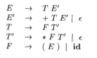

# Cfg to LL(1) Generator

## 运行方式
- Step 1 : 将仓库`clone`到本地或已安装`ocaml`虚拟机中

- Step 2 : 在`.ocamlinit`文件下运行
```
    dune build
```
- Step 3 : 执行如下代码进入`utop`调试
```
    dune utop lib
```

## Part 1 : 三个集合
### Cfg 结构：
定义了三个`type`数据类型组合成一个`Cfg`  
     
```ocaml
type symbol =
  | T of string (* terminal symbol *)
  | N of string (* nonterminal symbol *)
  | Epsilon (* empty string *)
  | End (* end marker *)

type production = (symbol * symbol list) list
type cfg = symbol list * symbol list * symbol * production
```   

定义一个`cfg`如下：
   
```ocaml
let cfg1 =
  ( [ N "E"; N "E'"; N "T"; N "T'"; N "F" ],
    [ T "+"; T "*"; T "("; T ")"; T "id"; Epsilon ],
    N "E",
    [
      (N "E", [ N "T"; N "E'" ]);
      (N "E'", [ T "+"; N "T"; N "E'" ]);
      (N "E'", [ Epsilon ]);
      (N "T", [ N "F"; N "T'" ]);
      (N "T'", [ T "*"; N "F"; N "T'" ]);
      (N "T'", [ Epsilon ]);
      (N "F", [ T "("; N "E"; T ")" ]);
      (N "F", [ T "id" ]);
    ] )
```   
上面定义的`cfg1`实际为：



### First集：

具体实现逻辑为：  
- Step 1 : 输入一个非终结符，在产生式左边进行匹配。
- Step 2 : 若在产生式左边匹配到该非终结符，则对产生式右边第一个符号进行匹配。
- Step 3 : 匹配产生式右边第一个符号。 
    - 若为终结符或`ε` ： 将该终结符和`ε`加入`First`集  。
    - 若为非终结符 ： 则递归调用该函数，寻找该非终结符的`First`集  。

例如：
```ocaml
first cfg1 (N "E") ;;
- : symbol list = [T "("; T "id"]
```

### Follow集：
具体实现逻辑为：
- Step 1 : 输入一个非终结符，在产生式右边进行匹配。
- Step 2 : 若在产生式右边匹配到该非终结符，则对该非终结符右边第一个符号进行匹配。
- Step 3 : 匹配该非终结符右边第一个符号。
    - 若为终结符 ： 将该终结符加入`Follow`集。
    - 若为非终结符(无法推导出`ε`) ： 则将该非终结符的`First`集加入目标非终结符的`Follow`集。
    - 若为非终结符(可推到出`epsilon`) ： 则将该非终结符的去掉`ε`后的`First`集与产生式左边非终结符的`Follow`集加入目标非终结符的`Follow`集。
    - 若为空：则递归调用该函数，将产生式左边非终结符的`Follow`集加入目标非终结符的`Follow`集。

例如 ：
```ocaml
follow cfg1 (N "E") ;;
- : symbol list = [End; T ")"]
```

### Select集：
具体实现逻辑为：
- Step 1 : 输入一个产生式，对产生式集合进行匹配。
- Step 2 : 若在集合中匹配到该产生式，则对该产生式右边所有符号进行匹配。
- Step 3 : 匹配产生式右边的所有符号。
   - 若产生式右边所有符号的`First`集中不存在`ε`，则将右边所有符号的`First`集加入该产生式的`Select`集
   - 若产生式右边符号的`First`集中存在`ε`，则将右边所有符号的`Fisrt`集与产生式左边非终结符的`Follow`集加入该产生式的`Select`集(去掉`ε`)

例如：
```ocaml
select cfg1 (N "E", [ N "T"; N "E'" ]) ;;
- : symbol list = [T "("; T "id"]
```
## Part 2 : Functions
### is_LL1
输入一个`cfg` , 返回一个布尔值，判断文法是否为LL(1)文法   
例如：
```ocaml
is_LL1 cfg2 ;;
- : bool = false
```

### is_left_dirct_recursion
输入一个`cfg` ， 返回一个布尔值，判断文法是否包含直接左递归   
例如：
```ocaml
is_left_dirct_recursion cfg2 ;;
- : bool = true
```
### eliminate_direct_left_recursion
输入一个`cfg` ， 返回一个新的`cfg` ， 消除直接左递归  
例如：   
```ocaml
eliminate_direct_left_recursion cfg2 ;;
- : cfg =
([N "X_"; N "X"; N "Y"; N "Z"], [T "a"; T "c"; T "d"], N "X",
 [(N "Y", [T "c"]); (N "Y", [Epsilon]); (N "Z", [N "Y"]);
  (N "Z", [T "d"; N "Y"]); (N "Z", [T "X"; N "Y"; T "Z"]);
  (N "X_", [T "c"; T "+"; N "X_"]); (N "X_", [T "c"; N "X_"]);
  (N "X", [N "Y"; N "X_"])])
```

### is_factor
输入一个`cfg` , 返回一个布尔值 ， 判断一个`cfg`是否含有左公因子  

例如：
```ocaml
is_factor cfg2 ;;
- : bool = true
```

### eliminate_left_factor
输入一个`cfg` ，返回一个新的`cfg` , 消除左公因子
例如：
```ocaml
eliminate_left_factor cfg2 ;;
- : cfg =
([N "X"; N "Y"; N "Z"; N "X'"; N "X''"], [T "a"; T "c"; T "d"], N "X",
 [(N "X", [N "Y"]); (N "Y", [T "c"]); (N "Y", [Epsilon]); (N "Z", [N "Y"]);
  (N "Z", [T "d"; N "Y"]); (N "Z", [T "X"; N "Y"; T "Z"]);
  (N "X", [N "X"; N "X'"]); (N "X'", [T "c"; N "X''"]); (N "X''", [T "+"]);
  (N "X''", [Epsilon])])
```